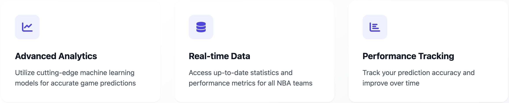

# NBA Game Prediction Platform

A machine learning-powered web application for predicting NBA game outcomes with high accuracy.



## 🌟 Features

- **Advanced ML Models**: Utilizes Logistic Regression, Random Forest algorithms, ELO three models for game predictions
- **Real-time Data**: Up-to-date NBA game statistics and team performance metrics
- **Interactive Dashboard**: Track prediction accuracy and view upcoming games
- **User Authentication**: Secure login system for personalized experience
- **Modern UI Design**: Powered by v0 AI design system, featuring intuitive layouts and smooth interactions
- **Responsive Design**: Optimized for both desktop and mobile devices

## 📊 Model Performance

### accuracy


### Performance comparsion


## 🚀 Live Demo

Experience the platform live at: https://nba-smart.vercel.app/


### result display


### game which is finished


## 🎨 UI Design

Our platform's user interface is primarily designed using v0 AI, a cutting-edge AI-powered design system. This approach ensures:

- **Consistent Design Language**: Unified visual elements across all pages
- **Intuitive Navigation**: AI-optimized user flows and interaction patterns
- **Modern Aesthetics**: Clean, professional look with carefully chosen color schemes
- **Responsive Layouts**: Seamlessly adapts to different screen sizes
- **Enhanced User Experience**: AI-driven component placement and spacing

## 🛠 Tech Stack

- **Backend**: Python, Flask
- **Database**: MySQL
- **Frontend**: HTML, Tailwind CSS, JavaScript
- **UI Design**: v0 AI Design System
- **ML Libraries**: Scikit-learn
- **Deployment**: Vercel

## 📂 Project Structure

```
.
├── api/
│   └── index.py              # Vercel serverless functions
├── static/
│   ├── css/                  # Stylesheets
│   ├── img/                  # Images and model visualizations
│   └── js/                   # JavaScript files
├── templates/                # HTML templates
├── app.py                    # Main Flask application
├── db-process-dashboard.py   # Dashboard data processing
└── requirements.txt          # Python dependencies
```

## 🔧 Setup & Installation

1. Clone the repository:
```bash
git clone https://github.com/JTW6912/nba-flask.git
cd nba-predictor
```

2. Create and activate a virtual environment:
```bash
python -m venv venv
source venv/bin/activate  # On Windows: venv\Scripts\activate
```

3. Install dependencies:
```bash
pip install -r requirements.txt
```

4. Set up environment variables:
```bash
# Create .env file with the following variables
MYSQL_DATABASE=your_database
MYSQLUSER=your_username
MYSQLPASSWORD=your_password
MYSQLHOST=your_host
MYSQLPORT=3306
SECRET_KEY=your_secret_key
```

5. Run the application:
```bash
python app.py
```

## 📱 Mobile View

Our mobile interface is carefully crafted using v0 AI design principles, ensuring a seamless experience on smaller screens while maintaining all core functionalities.

## 📈 Model Details

### Matrix Analysis


### Feature importance


### ROC curve


## 🔄 Data Pipeline

### Database

- using railway cloud server MYSQL


Our system continuously updates with:
- Real-time game data
- Team statistics
- Player performance metrics
- Historical game results

## 🎯 Prediction Process

1. Data Collection & Preprocessing
2. Feature Engineering
3. Model Selection & Training
4. Prediction Generation
5. Performance Monitoring

## 🔒 Security

- Secure user authentication
- Password hashing
- Environment variable protection
- SQL injection prevention
- CSRF protection

## 📊 Dashboard Features

- Prediction accuracy tracking
- Upcoming games display
- Historical predictions
- Performance statistics
- User analytics

## 🤝 Contributing

Contributions are welcome! Please feel free to submit a Pull Request.

## 📬 Contact

For any queries or suggestions, please reach out to:
- Email: wjt6912@gmail.com

## 🙏 Acknowledgments

- v0 AI Design System
- Scikit-learn community
- Flask framework
- Tailwind CSS team

---
Made with ❤️ for NBA fans and data enthusiasts 